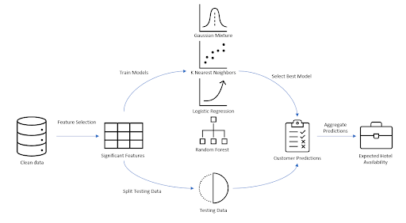
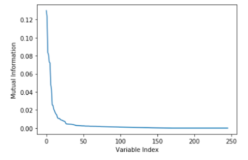

# Hotel Cancelation Prediction Analysis

## Background

The traveling industry is one of the biggest industries in the economy, and it contains countless problems that can be solved using machine learning methods. Busy travel seasons, such as the summertime, bring travelers to hotel booking sites in order to book their lodging for their next vacation getaways. However, instances can occur where travelers may have to cancel their hotel bookings for a variety of reasons, and hotels can often be left scrambling to make up the lost profit from cancellations. 

## Problem Statement
In the hospitality industry, hotel booking cancellations can be a significant problem for several reasons. For one, when a customer cancels a booking, it can be difficult for the hotel to fill that vacancy at short notice, especially if the cancellation takes place close to the date of the booking. This can result in lost revenue for the hotel. Additionally, managing cancellations and processing refunds can be time-consuming and costly for the hotel. Finally, high levels of cancellations can damage the hotel's reputation and make it less attractive to potential customers in the future.

The objective of this project is to create a predictive model that can anticipate whether a booking is likely to be canceled or not. This will help the hotels decide how many bookings they have on hand that are likely to be canceled, and it can help them decide whether they have the capacity to overbook travelers to make up for lost profit potential from expected cancellations. By predicting the likelihood of cancellations from the booking data and traveler features, the hotel can attempt to maximize its profit by properly weighing over and underbooking. 

## Data Source
The data used in this project comes from the article “Hotel Booking Demand Datasets” [1] by Antonio, Almeida, and Nunes. The data includes two years of information, spanning from July 2015 through August 2017, regarding both city hotels and resort hotels; the dataset contains approximately 120,000 data entries. The target value that we aim to predict is a binary column indicating whether or not a booking was canceled, and there are 31 explanatory features. About 75,000 of the data entries were not canceled, leaving 45,000 canceled entries; consequently, we can feel relatively safe that our data contains enough members of each class such that our models are able to successfully learn and predict. Other data features include the dates of the stay, the lead time of the booking, the length of the stay, the number of vacationers, and the number of amendments made to the booking, among about 20 other features that we plan to factor into our algorithms.

## Methodology
The following figure depicts the processes followed to predict whether or not a customer will cancel their hotel booking. 

Figure 1: High-Level Methodology

## Data Cleaning
Although not explicitly mentioned in Figure 1, the data was preprocessed before any analysis and model training occurred. Data preprocessing included removing duplicate rows from the dataset, and dropping columns that have a significant amount of missing data or columns deemed as unimportant features for our analysis.  For example, the column “Company” contains 94% NaN values, warranting a drop of the column. Additionally, categorical variables were converted to numerical columns by extrapolating out every category into a new column using a binary 1 or 0 to indicate whether the categorical variable is present or not. 

Because there was such a large amount of clean data points left over, imputing missing data was not performed. On the other hand, the decision to expand out the categorical variables increased the number of columns from 29 to 246, emphasizing the need for feature selection or dimensionality reduction.

Overall, every data point with missing information was dropped and the categorical variables were expanded into numerical columns, leaving 102,217 rows of clean data points with 246 columns of numerical data. 

## Feature Selection
After some preliminary data transformations and cleaning, the next goal was to filter out only the most significant features from the 246 features. To do this, the mutual information was calculated between each feature and the target variable (e.g. whether or not a booking is made). The features with the highest mutual information would be considered the most significant inputs to a predictive model.

To calculate mutual information, we need to first determine the probability distribution of each feature and the target variable. If there is a reduction in the uncertainty of the target variable after seeing the given feature, the feature is deemed to be informative. Mutual information is a measure of how informative each feature is relative to a target variable. The higher the mutual information, the more significant the feature is for predicting the target variable. To achieve this effectively, the group implemented a scikit-learn python package to calculate the mutual information for all 246 features.
One benefit of mutual information over other information metrics is that it is a non-parametric measure, which means that it makes no assumptions about the underlying distribution of the data. This allows it to be more robust and applicable to a wider range of data sets and capture more complex relationships than the strictly linear relationships that an F-test captures.
Once the mutual information was calculated for each feature, the top N features with the highest mutual information values were selected for use in the predictive model. Based on Figure 2 below, the mutual information degrades rapidly with each feature added, so the top 25 features were chosen in this case.

Figure 2 : Sorted Mutual Information of All 246 Features

Table 1 : Top 25 Selected Features

It is not necessarily surprising to see that the deposit type of a booking is highly predictive of whether or not a booking is canceled. Deposit Type is a categorical variable indicating how much money the customer already paid towards the booking. ADR or average daily rate is another monetary value that has a high predictive value to a cancellation. This observation also makes logical sense, as people’s money is usually an indication of how invested they are into their plans. The exact nature of these relationships are not discovered until models are fit to the data. See the logistic regression section for a discussion on some of these features’ relationship to the target variable.

Alternatively, feature selection was performed on the cleaned non-categorical dataset to see if models would perform better on the non-categorical data. To perform this, we plotted the correlation matrix of the features to see the heatmap of correlations in order to select the best features that would help predict our target variable of “is _canceled” . 

Figure 4: Correlation Matrix of Features

Based on the outputs of Figure 4, we sorted the highest correlation values in descending order. We selected a cutoff of 0.1 as to not overfit our features and this selected the top 7 features of lead time, previous cancellations, total of special requests, required car parking spaces, booking changes, agent, and days in waiting list. All of these features make sense that they would be highly correlated with prediction cancellations, and they are slightly different from the previous feature selection as this was the non-categorical dataset. 

Table 2: Correlation Selected Features

## Modeling
Once the data was cleaned and the dimensions reduced through feature selection or PCA, 4 different classification models were built and tuned to determine the best model to the most accurate predictions of whether or not a customer is going to cancel their booking or not. The 4 models were K Nearest Neighbors, Gaussian Mixture Model,  Logistic Regression, and Random Forest. 

The models were chosen based on their differing methods of classification that could potentially be successful in this case. For example, K Nearest Neighbors is a non-parametric model whereas logistic regression is a parametric model. For this dataset, non-parametric models seemed to outperform the parametric models.

## Train-Test Split
It is important to note that before the data was used for training classification models, that 20% of the cleaned and reduced data was reserved for testing. The other 80% was the training data for each of the 4 models. Each model was trained 3 distinct times on a scaled training set, a pca reduced training set, and a normal feature-selected training set, but the same training data was used to train the 4 models by using consistent seeding. After the models were trained, they all made predictions on the same testing data. We can explore the 4 fitted models and examine their outputs.

## KNN Classification
The K-Nearest Neighbors algorithm is a classification algorithm that we can apply to determine whether or not a reservation is likely to be canceled. KNN works by assigning a label to unclassified points after looking at the labels of the “k” nearest points, using some given similarity metric, such as Euclidean distance. We performed KNN on the original non-categorical dataset with reduced features performed from the correlation matrix. After performing a train-test split of 80-20 on the new dataframe, we performed KNN on several iterations of k to find the tune of the parameter of k to have the highest accuracy while making sure to not overfit. KNN achieved the best accuracy using a k of 6 nearest points with an accuracy of 79.4%. 

Figure 5 : KNN Tuning of K on Non-Categorical Dataset

Figure 6 : KNN on Non-Categorical Output Summary

We also performed KNN on the categorical dataset with the different features to keep consistent with the other models in order to evaluate all our models accurately. First we plotted the number of neighbor plots compared to accuracy to tune the parameter k for the highest accuracy for this dataset. 

Figure 7 : KNN Tuning of K on Categorical Included Dataset

Here we can see that the accuracy peaked at roughly 12 number of neighbor points, which we can use as k for our KNN model. After running our KNN model we achieved an accuracy of roughly 80%, which is very similar to the other dataset KNN model. 

Figure 8 : KNN on Categorical Included Data Output Summary

### EM Clustering
The EM Gaussian Mixture Model algorithm is an advanced clustering algorithm that assigns a probability of a given data point belonging to various Gaussian distributions. For this problem, we created the model with k=2 Gaussian clusters, since we are seeking to assign the points into two classes. In each step, the algorithm uses a log-likelihood function to modify and reassign the Gaussian clusters in a way that maximizes the probability of points belonging to those clusters. 

With this data, our Gaussian mixture model has a large disparity in its performance. Using the original data, the model achieves an accuracy of 73.8%, and using PCA-reduced data, the model achieves an accuracy of 61.7%. This decrease is to be generally expected, as some of the original data was likely lost in the data reduction. However, after scaling the data, the accuracy goes down to a mere 26.0%. This result is slightly unexpected; data scaling does not normally harm the quality of a model to such an extent. This suggests that the output of the model likely varies heavily from run-to-run, and is as such not a great fit for the hotel to use. However, this is not to say that the Gaussian mixture model is entirely worthless. Because the model is able to provide a probability of belonging to each class for each point (for example, 56% cancel and 44% not cancel), a hotel can still apply such a model and determine their own level of risk. In addition, if a hotel provides data with more than two classes (for example; cancel, not cancel, reschedule), the probability aspect becomes increasingly more valuable. Despite this, we do not recommend choosing this model as the best model for hotels to base their decisions on.

## Logistic Regression
A Logistic Regression model was one of the parametric models trained to predict whether a customer will cancel their hotel booking. The model was tuned using 10-fold cross-validation and 10 different regularization parameters of increasing orders of magnitude. The combination of cross-validation and regularization was used to prevent overfitting of the model by adding an  L2 penalty to the loss function of the model that discourages the model from fitting to the noise in the data, and instead encourages it to find a more generalizable solution. Figure 9 below shows how the regularization parameter can affect the accuracy of the model. 
Figure 9 : Model Accuracy vs Logistic Regression Regularization Parameter

From the curve depicted in Figure 9,  the best regularization parameter would be right after the accuracy starts to stabilize at its max to get the benefits of a high accuracy without causing the model to be underfit. The actual regularization parameter found in cross-validation was 545.56. At this value, the accuracy of the logistic regression is 77.6%. 

Although this is not the best accuracy of all the models, the advantage of a parametric approach like logistic regression is the extra insight offered by its coefficients. The magnitude and sign of the coefficient itself indicates the strength and direction of the relationship to the feature and whether or not a person will cancel their booking. Furthermore, each coefficient can be exponentiated into the odds ratio. The odds ratio says that as the value of the predictor variable increases, the odds of the target variable taking on a certain value also increase. Figure 6 shows the regression coefficient and odds ratio of each feature.

Table 3 : Logistic Regression Coefficients and Odds Ratios

Unsurprisingly, Table 3 reveals that a person with previous cancellations on their record is 3 times more likely to cancel a hotel booking again in the future than a person that has no record of canceling. Next, we look at the number of required car parking spaces on the other end of the spectrum. It has a very small odds ratio, less than 1, indicating that the more parking spaces required by the party, the more likely they are not to cancel the reservation, perhaps because this means they are already on the property.

Overall, the Logistic Regression is not the best with an accuracy of 77.6%, but the regularization parameter reassures that the model is not overfit and the relationships of features to the outcome are revealed through the coefficients.

## Random Forest

A random forest model is a powerful algorithm that seeks to use multiple decision trees to classify data points. Each decision tree makes its splits and classifies on a random selection of features, and the point is finally labeled with the majority classification from the forest. Random forests come with multiple hyperparameters to tune, namely, the regularization parameter alpha, and the number of trees in the forest. 

We are interested in finding a value for alpha that maximizes the performance of our tree. We can plot alpha against the impurity of leaves in our tree. By designing trees such that each leaf contains a homogenous group of labels (all training set points in a leaf all have the same label), we can be more confident that the output value is going to be correct. Furthermore, we can plot alpha against the depth of the trees and the number of leaves in each tree. We can see that the impurity of our leaves is minimized when alpha is set to 0, and this furthermore results in the deepest trees with the highest number of leaves. These trends are illustrated in Figures 10, 11, and 12 below. 

Figure 10 - Total impurity vs Regularization Parameter

Figures 11 & 12 - Number of nodes and tree depth versus regularization parameter

We are next interested in tuning the number of trees in the forest. If we have either too many or too few trees, then the random effects will harm the performance of the algorithm. We can plot the number of trees in the forest versus the accuracy of the classification and observe that the performance of our algorithm peaks with an accuracy of 86.4% when we use 75 trees in the forest. This algorithm is the highest-performing algorithm that we have developed.
Figures 13 - Tuning Number of Trees in Forest

## Principal Component Analysis (PCA)

Principal Component Analysis is a technique that allows us to reduce the dimensionality of our data. Dimensionality reduction can be extremely important, as it reduces the storage space of data. We run each of the above models on both the original dataset and a dimension-reduced dataset so that we can investigate whether or not we can create models with similar accuracy and lower storage intensity. We chose to reduce the dimensionality of the data to 6 principal components because the explained variance reduces to 0 after the 6th principal component. We will discuss the results of using PCA on the dataset for each model in the results section below. 

Figure 14 : Choosing Number of Components for PCA

## Evaluation

## Results

Table 4 reports the prediction accuracy of each of the tuned models depending on the training data used. As a reminder, the training data was either the top 25 selected features, the top 25 selected features scaled to unit variance, or the PCA reduced dataset using the top 6 most informative components.
Table 4 - Accuracy of Each Model Based on the Type of Training Data

The first observation is that the non-parametric model performed significantly better than the parametric models. This suggests that the data is highly complex and nonlinear, which explains why PCA-reduced training data consistently does worse in all models. Perhaps future projects could explore manifold learning techniques, such as the ISOMAP algorithm, for the hotel bookings dataset. We also see that Random Forest and KNN were the highest-performing accuracy models with an accuracy of 86.4% and 80%, respectively. This is a very strong accuracy for both models, and they perform much better than the other two; the Gaussian mixture model performs marginally better than the KNN model in each of the three categories. 

## Discussion
Given the fact that a Random Forest or K Nearest Neighbors model best predicts whether or not a hotel booking will get canceled, applying the model for a hotel to improve its business operations comes in many forms.
First, the model could be used to identify customers who are likely to cancel their booking, and target them with personalized marketing campaigns or offers to encourage them to keep their booking. This could help to reduce the overall number of cancellations and increase revenue for the hotel.
Second, the model could be used to predict the likelihood of cancellation for new bookings, and prioritize bookings with a low likelihood of cancellation. This could allow the hotel to allocate its resources more efficiently and maximize revenue by focusing on bookings that are less likely to be canceled.
Third, given that we now know which bookings are more likely to be canceled, the hotel can further plan its hotel room allocation more effectively. If the hotel knows that a significant portion of their bookings are likely to be canceled, they have more margin to overbook their hotel rooms in order to compensate for the lost revenue if they just let those rooms stay idle. 
Finally, the model could be used to improve the customer experience by identifying customers who are likely to cancel their bookings and proactively addressing any issues or concerns they may have. This could help to retain customers and improve the hotel's reputation.
All in all, machine learning is a powerful tool for hotels and the travel industry,  such as airlines, to use in order to target customers who are likely to cancel their reservations, choose to book with them, and many more applications. Understanding more about the customer and each individual booking through analytics can help improve the profit of hotels and the experience of customers. 

## References 
[1] Mostipak, J. (2020, February 13). Hotel Booking Demand. Kaggle. Retrieved December 10, 2022, from https://www.kaggle.com/datasets/jessemostipak/hotel-booking-demand 

